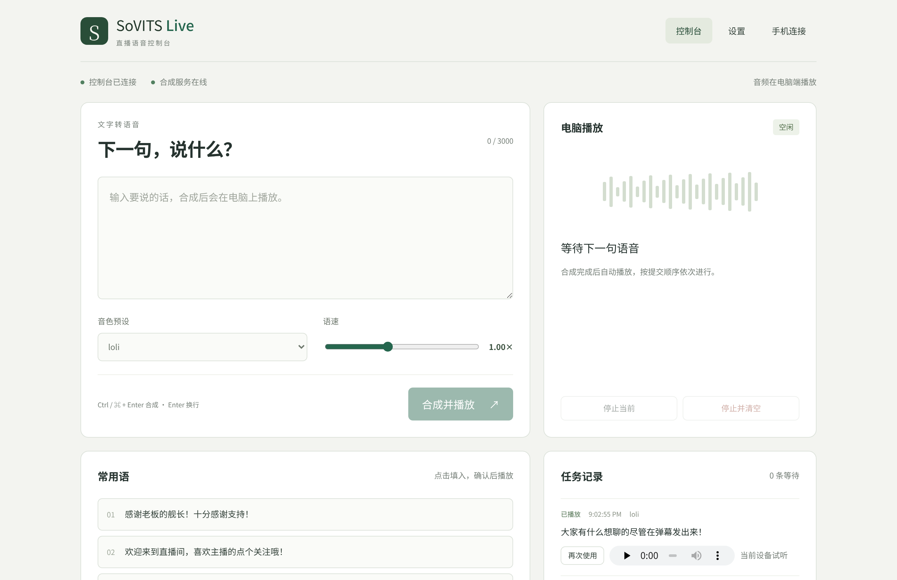

# GPT-SoVITS Live WebUI

**English** | [简体中文](#简体中文)

A configurable LAN voice console for [GPT-SoVITS](https://github.com/RVC-Boss/GPT-SoVITS). Type on your phone and play synthesized speech on your PC for OBS or livestreaming. Choose direct local inference without a GUI or HTTP API, or connect to an existing GPT-SoVITS API. The phone needs no app, and locking it does not interrupt playback.



## Features

- **Phone as a remote microphone**: open the LAN address in any phone browser, type or tap a phrase, and the PC speaks it.
- **Audio plays on the computer**: the server renders audio through `mpv` or `ffplay` on Linux, or PowerShell `SoundPlayer` on Windows, so playback survives the phone locking or leaving the page.
- **Works with your current setup**: talks to a running GPT-SoVITS API (default `http://127.0.0.1:9880`) and can import presets from your existing `GAG_config.json`.
- **Live queue**: tasks are synthesized and played in order, with stop-current and stop-and-clear controls plus a task history.
- **Optional Bilibili danmaku reading**: connect a live room, filter banned words and emoticons, then queue accepted comments for TTS. Per-user rate limits, duplicate suppression, command filtering and a queue cap prevent chat floods from taking over the stream.
- **Common phrases**: a persistent phrase list that fills the composer, so wording can be adjusted before synthesizing.
- **Built-in network diagnostics**: startup checks for firewall rules that would block the phone, an `/api/diagnostics` endpoint, and per-request logs with source IPs.
- **Cross-platform**: Linux and Windows, with startup scripts for both.

## How it works

```
phone browser ──HTTP/WebSocket──▶ Fastify server (9870) ──▶ local Python worker / external API
                                       │
                                       ├──▶ mpv / ffplay / SoundPlayer ──▶ PC speakers ──▶ OBS
                                       │
                                       └──▶ Bilibili live WebSocket (optional danmaku input)
```

The phone is only a controller. Synthesis and playback both happen on the PC, which keeps the audio chain stable while streaming.

## Requirements

- **Node.js 20.19+ or 22.12+** (required by Vite 8).
- Local mode: a **GPT-SoVITS installation**, its working Python environment, inference YAML and model files. External mode: a running **GPT-SoVITS API**. Model weights and Python/PyTorch are not included in the WebUI bundles.
- A local player: `mpv` is preferred on Linux, `ffplay` also works. Windows falls back to PowerShell `SoundPlayer`.
- Phone and PC on the same LAN.

## Quick start

### Prebuilt bundles

Every tagged release ships a runnable bundle for Linux and Windows. Download the archive for your system from [Releases](https://github.com/matsuzaka-yuki/gpt-sovits-live-webui/releases), unpack it, and start the app. The bundle already contains production dependencies and the built UI, so no `npm install` is needed.

### Linux

```bash
./start.sh
```

### Windows

Double-click `start.bat`. Run it as administrator once so it can add the inbound firewall rule automatically.

### Manual

```bash
npm install
npm run build
npm start
```

The console prints the local and LAN addresses on startup. Open the LAN address (for example `http://192.168.8.238:9870`) on your phone, or scan the QR code from the phone dialog in the UI.

## Configuration

### Inference modes and persistent settings

New installations default to **local inference**. Existing configurations without a mode retain **external API** mode. In Settings, select the mode and save. Settings, voice presets, reference audio parameters, common phrases and output preferences persist in `data/config.json`; keep this directory when upgrading. Saves use atomic replacement, and unreadable configuration files produce an explicit error rather than silently resetting your settings.

For local inference, configure the GPT-SoVITS root directory, the Python executable from its environment (Windows: `runtime/python.exe` or `.venv/Scripts/python.exe`; Linux: `.venv/bin/python`), and the inference YAML. Optional GPT/SoVITS weight overrides, device, precision, timeout and startup loading are available. Relative model, YAML and reference paths resolve against the GPT-SoVITS root. The YAML provides model version, BERT and HuBERT paths. Choose compatible weights and version.

Click **Save and load model**, or submit your first synthesis request to load on demand. The app owns a persistent Python worker that imports `TTS_infer_pack.TTS` directly and communicates over process pipes. It does not start or call `api_v2.py`, a GUI, or an HTTP inference endpoint. Worker logs and state appear in Settings. Stopping an active synthesis terminates the worker; the next request reloads the model. Normal app shutdown releases its worker. The upstream YAML is preserved; runtime configuration is written to `data/local-inference.yaml`.

For external mode, enter the `/tts` URL. Optional GUI preset import remains available. You can also create, overwrite and delete voice presets directly in Settings without any GUI configuration. Presets contain reference and synthesis parameters; models are configured separately. Clear the queue before changing the inference connection or models.

Local mode still requires GPT-SoVITS and its dependencies; it removes the GUI/API dependency, not the inference engine. CI checks app behavior on Windows and Linux; GPU compatibility depends on the installed GPT-SoVITS/PyTorch environment.

Settings are stored in `data/config.json` and can be edited from the Settings tab:

| Setting | Description |
| --- | --- |
| API endpoint | GPT-SoVITS `/tts` endpoint, default `http://127.0.0.1:9880/tts` |
| GUI config path | Path to `GAG_config.json`, used to import voice presets |
| Reference audio and prompt text | The reference clip and its transcript sent to the API |
| Text and prompt language | `all_zh`, `zh`, `en`, `ja`, and so on |
| Text split method | `cut0` to `cut5` |
| Output device, volume, player | Which device plays the audio and how loud |

Importing presets only copies voice parameters. It does not switch the GPT or SoVITS models already loaded in your GPT-SoVITS instance.

### Bilibili danmaku (optional)

The Bilibili panel in Settings can listen to a live room and add accepted comments to the same TTS queue. It uses the maintained community WebSocket protocol, not the official Live Open Platform, so no developer application or anchor authorization is required. The default visitor session is created automatically; if Bilibili risk control starts returning `-352` or hides sender names, paste a browser Cookie into Advanced Settings as a fallback.

Room ID, filters and limits are stored in `data/config.json` with the rest of the settings. The main options are:

| Setting | Description |
| --- | --- |
| Room ID | The number in `live.bilibili.com/<room>`, for example `5928158`. |
| Auto-read | When enabled, accepted comments enter the computer playback queue. When disabled, the panel only monitors and previews comments. |
| Banned words | One word per line or comma-separated. `mask` replaces matches with `*`; `drop` ignores the whole comment. |
| Queue cap | Stop adding comments when this many tasks are already waiting. Manual submissions continue to work. |
| Rate / duplicate windows | Suppress repeated messages from one user and comments that repeat too quickly. |
| Advanced filters | Ignore `!`, `/`, `#` commands, strip URLs and `[emoticon]` tags, and set an optional spoken prefix. |
| Spoken template | A dynamic prefix that can include the sender name: `{user}` (nickname), `{name}` (alias), `{uid}` (user id) and `{room}` (room id). For example `{user}说：` is read as `小明说：你好`. Pick one from the quick-select list or type your own; the panel previews the result live. |

Bilibili hides sender nicknames from anonymous visitors. The raw comment payload of a visitor session carries `uid = 0` and a masked name such as `M***`, so no client can recover the real name without logging in. Those comments are read as `观众` instead of the placeholder, and a template such as `观众{user}说：` collapses to `观众说：` instead of repeating the word twice.

To hear real nicknames, paste your own Cookie into Advanced Settings (it must contain `SESSDATA`). The listener then runs as your logged-in account and Bilibili delivers the full name and UID. The panel shows which session is in use: `当前会话：已登录（UID …）` means real names are available, while `当前会话：访客` means every name will be masked, and the note also counts how many masked names have already arrived.

The listener reconnects with exponential backoff. Its status, counters, connection log and the last filtered comments are visible in Settings. Changing the room, Cookie or enabled state restarts the listener; changing filters applies to the next comment without dropping the connection. The room owner can leave this feature disabled and use the phone composer independently.

## Troubleshooting

If the phone cannot open the page, check these in order:

1. **Firewall blocking the port.** This is the most common cause. Verify with `npm run firewall`, then:
   - Linux (ufw): `bash scripts/allow-firewall.sh`, or `sudo ufw allow from 192.168.8.0/24 to any port 9870 proto tcp`
   - Linux (firewalld): `sudo firewall-cmd --permanent --add-port=9870/tcp && sudo firewall-cmd --reload`
   - Windows: `netsh advfirewall firewall add rule name="GPT-SoVITS Live WebUI" dir=in action=allow protocol=TCP localport=9870`
   - Evidence: `journalctl -k | grep UFW` shows `[UFW BLOCK] ... DPT=9870`, or the server log contains no request from the phone IP at all.
2. **Different networks.** The phone must be on the same Wi-Fi, not mobile data and not a guest network.
3. **AP isolation.** Some guest networks block devices from talking to each other.
4. **The PC's LAN IP changed.** Use the address printed at startup or check `/api/diagnostics`.

Requests are logged with their source IP. When the phone connects you will see a line such as:

```
2026-09-11T13:02:37.463Z 192.168.8.240 POST /api/tts -> 200
```

When started through `start.sh`, the log is also written to `data/server.log`.

## API

| Endpoint | Method | Purpose |
| --- | --- | --- |
| `/api/status` | GET | API health, LAN address, QR code, firewall state, queue |
| `/api/tts` | POST | Enqueue text: `{ "text": "...", "presetName": "..." }` |
| `/api/control/stop` | POST | Stop the current playback |
| `/api/control/clear` | POST | Stop and clear the whole queue |
| `/api/queue/:id` | DELETE | Remove one queued task |
| `/api/devices` | GET | List audio output devices |
| `/api/diagnostics` | GET | Platform, listening address, LAN URLs, firewall check |
| `/api/bilibili/status` | GET | Danmaku listener state, counters, logs and recent comments |
| `/api/bilibili/start` | POST | Persist `enabled=true` and start listening to the configured room |
| `/api/bilibili/stop` | POST | Persist `enabled=false` and stop listening |
| `/ws` | WebSocket | Live queue and config updates |

## Development

```bash
npm run dev:client   # Vite dev server for the UI
npm run dev:server   # backend on port 9870
npm run build        # build the client into client/dist
npm test             # unit tests
npm run smoke        # boots the server and checks the HTTP surface
npm run verify       # build + unit tests + smoke test
```

The backend is Fastify with a WebSocket channel, the frontend is Vue 3 with Vite, and runtime data (config, cached audio, logs) lives in `data/`, which is git-ignored.

GitHub Actions runs `npm run verify` on Linux and Windows with Node 20 and 22. Pushing a `v*` tag runs the same verification, then packages both platform bundles, smoke tests the packaged bundle, and publishes them to the GitHub release.

## Notes

This tool has no authentication. It is meant for a trusted local network, so do not expose port 9870 to the internet.

## License

[MIT](LICENSE)

---

## 简体中文

[English](#gpt-sovits-live-webui) | **简体中文**

可配置的 [GPT-SoVITS](https://github.com/RVC-Boss/GPT-SoVITS) 局域网直播配音控制台。手机负责打字，可选择不依赖 GUI 和 HTTP API 的独立本地推理，也可连接现有 GPT-SoVITS API。声音从电脑播放，供 OBS 或直播软件捕获；手机不用装 App，锁屏也不影响电脑继续出声。


## 功能

- **手机当遥控话筒**：手机浏览器打开局域网地址，打字或点常用语就能让电脑发声。
- **电脑本地播放**：音频由服务端调用播放器输出（Linux 优先 `mpv`，也支持 `ffplay`；Windows 兜底 PowerShell `SoundPlayer`），手机锁屏或离开页面都不影响。
- **对接现有环境**：连接你正在运行的 GPT-SoVITS API（默认 `http://127.0.0.1:9880`），可导入现有 `GAG_config.json` 里的音色预设。
- **直播队列**：按提交顺序依次合成播放，支持停止当前、停止并清空，并保留任务记录。
- **可选 B 站弹幕朗读**：连接直播间后自动过滤违禁词、表情和链接，再把可朗读弹幕加入同一个合成队列；支持单用户频率限制、重复弹幕抑制、命令过滤和队列上限，避免弹幕刷屏占满直播音频。
- **常用语**：常驻常用语列表，点击后填入输入框，可改字再合成。
- **内置排障**：启动时自动检查防火墙是否拦截手机访问，提供 `/api/diagnostics` 诊断接口和带来源 IP 的请求日志。
- **跨平台**：Linux 与 Windows 均有启动脚本。

## 工作原理

```
手机浏览器 ──HTTP/WebSocket──▶ Fastify 服务 (9870) ──▶ 本地 Python 推理 / 外部 API
                                     │
                                     ├──▶ mpv / ffplay / SoundPlayer ──▶ 电脑扬声器 ──▶ OBS
                                     │
                                     └──▶ B站直播 WebSocket（可选弹幕输入）
```

手机只是控制器，合成和播放都在电脑上完成，这样直播中的音频链路才稳定。

## 环境要求

- **Node.js 20.19+ 或 22.12+**（Vite 8 的要求）。
- 本地模式需要已安装的 **GPT-SoVITS**、可用的 Python 环境、推理 YAML 和模型；外部模式需要已启动的 **GPT-SoVITS API**。WebUI 发布包不包含模型与 Python/PyTorch。
- 本地播放器：Linux 推荐 `mpv`，也支持 `ffplay`；Windows 兜底使用 PowerShell `SoundPlayer`。
- 手机和电脑在同一局域网。

## 快速开始

### 预构建包

每个带 tag 的 Release 都会提供 Linux 与 Windows 的可运行压缩包。到 [Releases](https://github.com/matsuzaka-yuki/gpt-sovits-live-webui/releases) 下载对应系统的压缩包，解压后直接启动即可。压缩包里已经包含生产依赖和构建好的前端，不需要再执行 `npm install`。

### Linux

```bash
./start.sh
```

### Windows

双击 `start.bat`。建议首次以管理员身份运行，脚本会自动添加防火墙入站规则。

### 手动启动

```bash
npm install
npm run build
npm start
```

启动后控制台会打印本机与局域网地址。手机打开局域网地址（例如 `http://192.168.8.238:9870`），或在界面的「手机连接」弹窗里扫码。

## 配置说明

### 推理模式与持久化

全新安装默认使用**独立本地推理**；旧配置没有模式字段时继续使用**外部 API**。在设置页选择模式并保存，重启后继续使用。运行模式、音色预设、参考音频参数、常用语和播放设置保存在 `data/config.json`，升级时保留整个 `data` 目录。配置采用原子替换保存；文件损坏会明确报错，不会静默恢复默认值并覆盖它。

本地模式需填写 GPT-SoVITS 根目录、对应环境的 Python 可执行文件（Windows 通常为 `runtime/python.exe` 或 `.venv/Scripts/python.exe`，Linux 为 `.venv/bin/python`）以及推理 YAML。可选配置包括 GPT/SoVITS 权重覆盖、运行设备、精度、超时和启动时加载。相对模型、YAML 和参考音频路径均以 GPT-SoVITS 根目录为准。模型版本、BERT 和 HuBERT 路径由 YAML 提供，请使用相互兼容的版本与权重。

点击“保存并加载模型”，或首次合成时按需加载。项目直接通过常驻 Python 进程调用 `TTS_infer_pack.TTS`，不启动也不请求 GUI、`api_v2.py` 或 HTTP 推理接口。设置页可查看状态和日志。取消正在执行的本地合成会终止进程，下次请求重新加载模型；正常退出控制台会释放进程。原推理 YAML 不会被修改，运行时配置另存为 `data/local-inference.yaml`。

外部模式填写 `/tts` 地址即可，仍可选择导入 GUI 预设。两种模式都支持在设置页直接新建、覆盖和删除音色预设，不再需要 GUI 配置文件。音色预设保存参考音频和合成参数，模型单独配置。修改推理连接或模型前请先清空队列。

独立模式仍需要 GPT-SoVITS 引擎和依赖。Windows/Linux 自动验证覆盖应用行为；GPU 兼容性取决于所安装的 GPT-SoVITS/PyTorch 环境。

配置保存在 `data/config.json`，也可以在「设置」页修改：

| 配置 | 说明 |
| --- | --- |
| API 地址 | GPT-SoVITS 的 `/tts` 接口，默认 `http://127.0.0.1:9880/tts` |
| GUI 配置文件路径 | `GAG_config.json` 路径，用于导入音色预设 |
| 参考音频与参考文字 | 提交给 API 的参考音频及其文本 |
| 合成语言与参考语言 | `all_zh`、`zh`、`en`、`ja` 等 |
| 文本切分方式 | `cut0` 到 `cut5` |
| 输出设备、音量、播放器 | 决定声音从哪里播出、音量多大 |

导入预设只会复制音色参数，不会切换你 GPT-SoVITS 里已经加载的 GPT / SoVITS 模型。

### B 站弹幕朗读（可选）

设置页的 B 站弹幕面板可以监听指定直播间，并把通过过滤的弹幕加入同一个合成队列。它使用社区维护的 WebSocket 协议，不依赖 B 站直播开放平台，因此不需要申请开发者应用。默认使用访客会话；需要真实用户名时，点击“扫码登录 B站”，用哔哩哔哩 App 扫码并确认即可，无需手动复制 Cookie。

登录弹窗会显示等待扫码、等待手机确认、登录成功和二维码过期状态，二维码过期后可刷新。确认后登录信息自动保存在本机配置中，正在运行的监听会自动重连；未启动的监听仍需手动启动。关闭弹窗会停止轮询。扫码不可用时，高级设置中仍保留手动 Cookie 备用入口。

房间号、过滤规则和限制与会话配置一起保存在 `data/config.json`。主要选项如下：

| 配置 | 说明 |
| --- | --- |
| 房间号 | `live.bilibili.com/<room>` 中的数字，例如 `5928158`。 |
| 自动朗读 | 开启后，通过过滤的弹幕进入电脑播放队列；关闭时只监听并预览弹幕。 |
| 智能清理朗读文本 | 默认关闭。开启后清理弹幕及用户名中的 emoji、不可见字符和装饰符号，统一全半角并合并连续标点；保留中英文、数字，空内容跳过。保存后对新弹幕生效，任务记录显示实际朗读文本。 |
| 违禁词 | 每行一个或用逗号分隔。`替换后朗读` 会把命中内容替换为 `*`，`整条忽略` 会跳过整条弹幕。 |
| 队列上限 | 等待合成的任务达到该数量后，不再继续加入弹幕；手动提交的合成不受影响。 |
| 频率 / 重复窗口 | 限制同一用户连续发送和重复弹幕进入朗读。 |
| 高级过滤 | 忽略以 `!`、`/`、`#` 开头的命令，过滤链接和 `[表情]` 标签，并可设置朗读前缀。 |
| 朗读模板 | 前缀可以是动态的，支持 `{user}`（用户名）、`{name}`（同上）、`{uid}`（用户 ID）和 `{room}`（房间号）。例如填 `{user}说：`，弹幕“你好”会朗读成“小明说：你好”。面板里有快速选择，也可以自己写模板，并实时预览效果。 |

B 站对未登录访客会隐藏昵称。访客会话拿到的原始弹幕数据里 `uid = 0`、昵称是 `M***` 这种打码形式，所以任何客户端在不登录的情况下都拿不到真实用户名。这类弹幕会朗读成“观众”，不会把星号念出来；模板写成 `观众{user}说：` 时也会合并成“观众说：”，不会重复两次。

想朗读真实用户名，请在高级设置里填写自己的 Cookie（必须包含 `SESSDATA`）。监听会以登录身份运行，B 站就会下发完整昵称和 UID。面板里会显示当前用的是哪种会话：`当前会话：已登录（UID …）` 表示能拿到真实用户名，`当前会话：访客` 表示所有昵称都会被打码，并会统计已经收到多少条打码昵称。

监听器断开后会按指数退避自动重连。设置页会显示连接状态、计数、日志和最近过滤结果。修改房间号、Cookie 或启用状态会重启监听；修改过滤规则只会作用于下一条弹幕，不会断开连接。主播不需要该功能时保持关闭即可，手机手动打字合成不受影响。

智能清理使用本地规则，不调用 AI，也不会删除正常英文。如果出现 `averaged_perceptron_tagger_eng not found`，需要在实际运行 GPT-SoVITS 的 Python 环境中执行 `python -m nltk.downloader averaged_perceptron_tagger_eng` 补齐英文资源；文本清理无法替代缺失的语言资源。

## 手机连不上页面时

按顺序排查，第一条最常见：

1. **防火墙拦截端口。** 先执行 `npm run firewall` 自检，然后：
   - Linux（ufw）：`bash scripts/allow-firewall.sh`，或 `sudo ufw allow from 192.168.8.0/24 to any port 9870 proto tcp`
   - Linux（firewalld）：`sudo firewall-cmd --permanent --add-port=9870/tcp && sudo firewall-cmd --reload`
   - Windows：`netsh advfirewall firewall add rule name="GPT-SoVITS Live WebUI" dir=in action=allow protocol=TCP localport=9870`
   - 判断依据：`journalctl -k | grep UFW` 出现 `[UFW BLOCK] ... DPT=9870`，或者服务日志里完全没有手机 IP 的请求。
2. **不在同一个网络。** 手机要连同一个 Wi-Fi，不能用流量，也不能是访客网络。
3. **路由器开了 AP 隔离。** 部分访客 Wi-Fi 会禁止设备互访。
4. **电脑局域网 IP 变了。** 以启动日志打印的地址为准，或访问 `/api/diagnostics` 查看。

服务日志会记录每个请求的来源 IP，手机连上后能看到类似：

```
2026-09-11T13:02:37.463Z 192.168.8.240 POST /api/tts -> 200
```

通过 `start.sh` 启动时，日志同时写入 `data/server.log`。

## 接口

| 接口 | 方法 | 用途 |
| --- | --- | --- |
| `/api/status` | GET | API 状态、局域网地址、二维码、防火墙状态、队列 |
| `/api/tts` | POST | 提交文本：`{ "text": "...", "presetName": "..." }` |
| `/api/control/stop` | POST | 停止当前播放 |
| `/api/control/clear` | POST | 停止并清空队列 |
| `/api/queue/:id` | DELETE | 删除某条待播任务 |
| `/api/devices` | GET | 列出音频输出设备 |
| `/api/diagnostics` | GET | 平台、监听地址、局域网 URL、防火墙检查 |
| `/api/bilibili/status` | GET | 弹幕监听状态、计数、日志和最近弹幕 |
| `/api/bilibili/start` | POST | 持久化 `enabled=true` 并开始监听配置的直播间 |
| `/api/bilibili/stop` | POST | 持久化 `enabled=false` 并停止监听 |
| `/ws` | WebSocket | 实时推送队列与配置变化 |

## 开发

```bash
npm run dev:client   # 前端 Vite 开发服务器
npm run dev:server   # 后端，端口 9870
npm run build        # 构建前端到 client/dist
npm test             # 单元测试
npm run smoke        # 启动真实服务并检查 HTTP 行为
npm run verify       # 构建 + 单元测试 + 冒烟测试
```

后端是 Fastify 加 WebSocket，前端是 Vue 3 + Vite，运行时数据（配置、音频缓存、日志）放在 `data/`，已加入 `.gitignore`。

GitHub Actions 会在 Linux 和 Windows 上、Node 20 与 22 环境里执行 `npm run verify`。推送 `v*` tag 时会先跑同样的验证，然后打包两个平台的压缩包，在打包目录里再跑一次冒烟测试，最后发布到 GitHub Release。

## 说明

本工具没有鉴权，只适合可信的局域网环境，不要把 9870 端口暴露到公网。

## 协议

[MIT](LICENSE)
